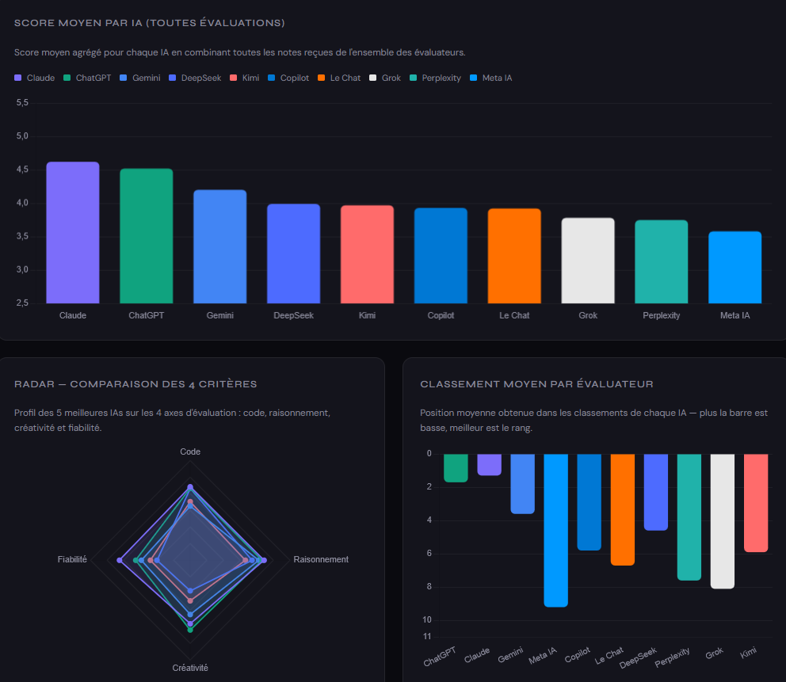
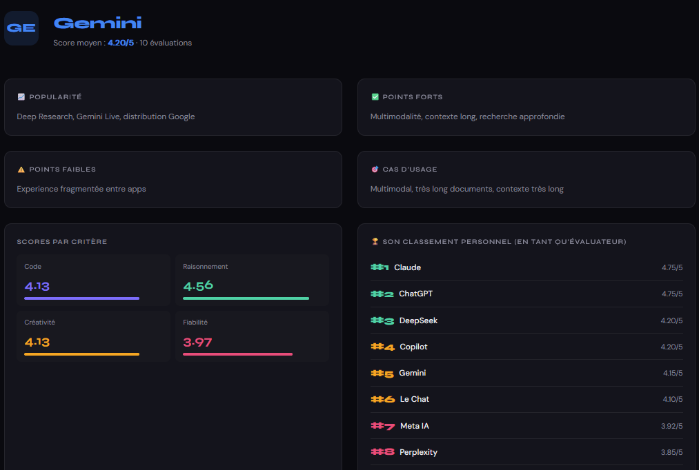

# IA.RESEARCH

<p align="center">
  
  
</p>

# IA Research — AI Benchmark Dashboard

Dashboard interactif comparant les principales IA du marché à travers des évaluations croisées.

---

## Objectifs

L'objectif est de demontrer :

- les différences de notations entre les IA
- Leurs forces et leurs limites
- Les usages les plus pertinants au besoin

Je précise que ce projet est une analyse indépendante réalisée a des fins de recherches et de visualisation. Mes recherches étaient dans un premier temps personnelles mais j'ai décidé de les publier pour que le plus grand nombre puisse en profiter.

---

## Aperçu

Ce projet analyse et compare 10 modèles d’IA majeurs à partir de plusieurs critères :

- Sa popularité
- Ses points forts
- Ses points faibles
- Ses Cas d'utilisations
- Code (noté sur 5)
- Raisonnement (noté sur 5)
- Créativité (noté sur 5)
- Fiabilité (noté sur 5)

Chaque IA évalue les autres afin de construire :

- un classement global
- Des graphiques
- Des fiches détaillé
- Une matrice croisée
- Des biais d'évaluation

---

## Création

L'ensemble des recherches et de la collecte de données a été réalisé manuellement à partir d'un prompt unique, disponible dans ce dépôt.

Une fois les données réunies et structurées, le site a été développé en no-code avec Claude Sonnet 4.6. Ce choix a été fait afin de me concentrer sur l'analyse, la méthodologie et la présentation des résultats plutôt que sur l'implémentation technique de l'interface.

Je tiens à preciser que les données ont été verifié après la conception du site

## Technologies

- HTML5
- CSS3
- JavaScript Vanilla
- Chart.js

---

## Structure

```bash
/
├── index.html
├── prompt.txt
├── images/
├── README.md
```

---

*Talk is cheap, show me the code.*

